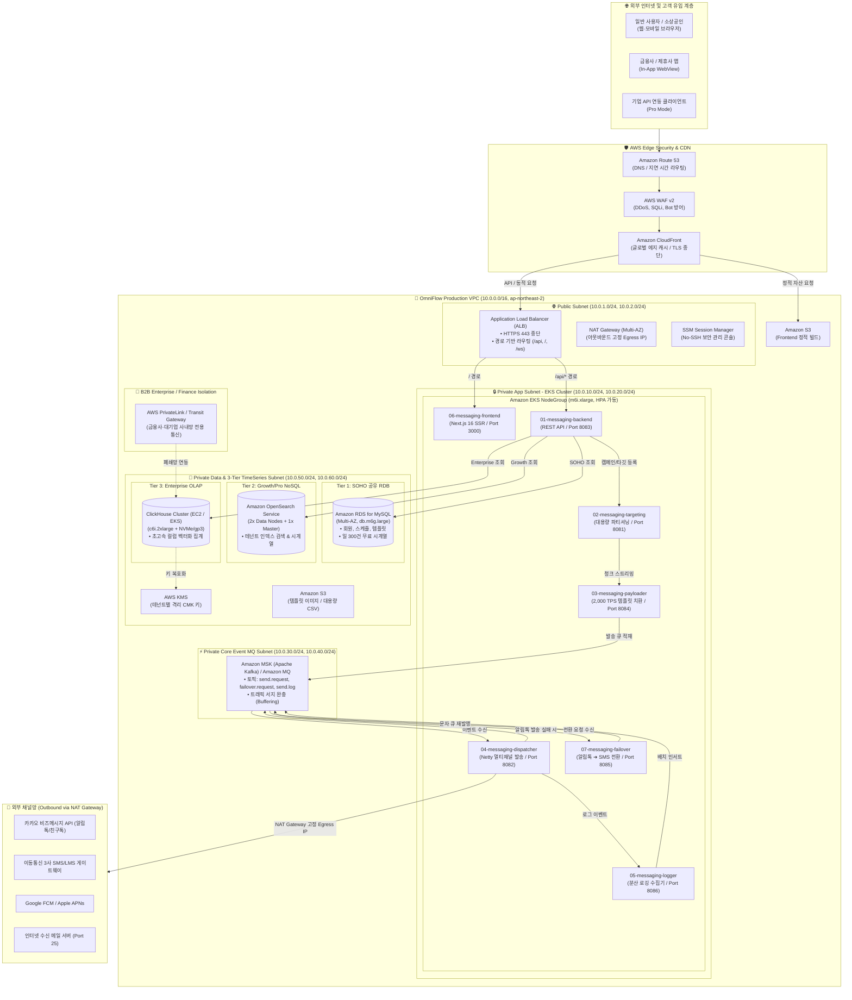
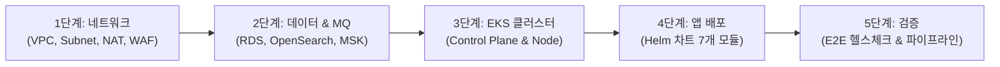

# 🏗️ OmniFlow AWS 클라우드 인프라 배포 설계서 및 리소스 명세서
## (AWS Production Cloud Deployment Architecture & Resource Blueprint)

본 문서는 **OmniFlow v1.0** 옴니채널 메시징 플랫폼을 AWS(Amazon Web Services) 환경에 안정적이고 확장 가능하게 설치·배포하기 위한 **전체 클라우드 인프라 아키텍처 다이어그램, VPC 망분리 네트워크 구성, AWS 리소스 카탈로그, 3-Tier 스토리지 연동 및 단계별 설치 런북(Runbook)**을 정의합니다.

---

## 🏛️ 1. 엔터프라이즈 AWS 인프라 전체 구성도 (Architecture Diagram)

본 아키텍처는 서울 리전(`ap-northeast-2`)의 **2개 가용 영역(Multi-AZ: 2a, 2c)**을 활용하여 단일 장애점(SPOF)이 없는 고가용성(High Availability)과 금융권 기준에 부합하는 엄격한 **4계층 망분리(Edge ➔ Public ➔ Private App ➔ Private Core/Data)**를 구현합니다.



---

## 📋 2. AWS 리소스 인벤토리 및 사이징 명세서 (Resource Catalog)

### 2.1 네트워크 및 보안 인프라 (Network & Security)
| 리소스 이름 | AWS 서비스 | 상세 규격 / 인스턴스 타입 | 가용 영역 | 주요 용도 |
| :--- | :--- | :--- | :---: | :--- |
| **`omniflow-vpc`** | Amazon VPC | CIDR `10.0.0.0/16` (65,536 IPs) | ap-northeast-2 | 전체 서비스 격리 가상 네트워크 |
| **`public-subnets`** | Subnet (Public) | `10.0.1.0/24`, `10.0.2.0/24` | 2a, 2c | 인터넷 게이트웨이(IGW), ALB, NAT GW |
| **`private-app-subnets`** | Subnet (Private) | `10.0.10.0/24`, `10.0.20.0/24` | 2a, 2c | EKS 마이크로서비스 워크로드 |
| **`private-mq-subnets`** | Subnet (Private) | `10.0.30.0/24`, `10.0.40.0/24` | 2a, 2c | Amazon MSK (Kafka) 브로커 |
| **`private-data-subnets`**| Subnet (Private) | `10.0.50.0/24`, `10.0.60.0/24` | 2a, 2c | RDS MySQL, OpenSearch, ClickHouse |
| **`nat-gateways`** | NAT Gateway | EIP 2개 할당 (Multi-AZ 이중화) | 2a, 2c | 외부 통신사/카카오 연동 시 고정 IP 송출 |
| **`omniflow-alb`** | Application LB | Dual-stack, Cross-Zone Load Balancing | 2a, 2c | HTTPS 443 트래픽 수용 및 백엔드 라우팅 |
| **`omniflow-waf`** | AWS WAF v2 | Rate-limiting, Core Rule Set (CRS) | CloudFront/ALB | DDoS 공격 및 악의적 웹 인젝션 차단 |
| **`tenant-kms`** | AWS KMS | Customer Managed Keys (CMK) | Regional | B2B 테넌트별 대칭 암호화 키 격리 |

### 2.2 컴퓨팅 및 컨테이너 계층 (EKS Workloads)
| 워크로드 (Pod) | 네임스페이스 | Base Replica | CPU Req/Limit | Mem Req/Limit | HPA 정책 (CPU 기준) |
| :--- | :--- | :---: | :---: | :---: | :---: |
| **`06-messaging-frontend`** | `omniflow-web` | 2 | 500m / 1,000m | 1Gi / 2Gi | Min 2 / Max 6 (70% 초과 시 확장) |
| **`01-messaging-backend`**  | `omniflow-app` | 2 | 1,000m / 2,000m | 2Gi / 4Gi | Min 2 / Max 8 (75% 초과 시 확장) |
| **`02-messaging-targeting`**| `omniflow-core`| 2 | 1,000m / 2,000m | 2Gi / 4Gi | Min 2 / Max 6 (청크 작업 부하 시) |
| **`03-messaging-payloader`**| `omniflow-core`| 4 | 2,000m / 4,000m | 4Gi / 8Gi | Min 4 / Max 16 (2,000 TPS 방어) |
| **`04-messaging-dispatcher`**| `omniflow-core`| 4 | 2,000m / 4,000m | 4Gi / 8Gi | Min 4 / Max 16 (대량 발송 분기) |
| **`07-messaging-failover`**  | `omniflow-core`| 2 | 1,000m / 2,000m | 2Gi / 4Gi | Min 2 / Max 8 (전환 큐 지연 시) |
| **`05-messaging-logger`**    | `omniflow-app` | 2 | 1,000m / 2,000m | 2Gi / 4Gi | Min 2 / Max 8 (로그 인제스천 부하) |

> 💡 **EKS 노드 인스턴스 규격**: `m6i.xlarge` (4 vCPU, 16 GiB) Spot/On-Demand 혼합 풀 (Karpenter 오토스케일러 연동).

### 2.3 메시지 큐 및 3-Tier 시계열 스토리지 계층
| 서비스 레이어 | 구현 엔진 | AWS 서비스 및 규격 | 스토리지 용량 | 고가용성(HA) |
| :--- | :--- | :--- | :---: | :---: |
| **이벤트 버퍼 (MQ)** | Apache Kafka | **Amazon MSK** (`kafka.m5.large`, 3 Brokers) | 1,000 GB EBS / 브로커 | 3 가용영역 복제 |
| **Tier 1 (SOHO 공유 RDB)**| MySQL 8.0 | **Amazon RDS for MySQL** (`db.m6g.large`) | 500 GB (gp3, 3,000 IOPS)| Multi-AZ 자동 페일오버 |
| **Tier 2 (Growth NoSQL)**  | OpenSearch | **Amazon OpenSearch Service** (2x `m6g.large.search`) | 1,000 GB EBS (gp3) | Multi-AZ (Active-Standby) |
| **Tier 3 (Enterprise OLAP)**| ClickHouse | **EC2 Stateful Cluster** (2x `c6i.2xlarge` NVMe) | 2 TB NVMe SSD + S3 티어링 | Keeper 쿼럼 기반 복제 |
| **오브젝트 스토리지** | Amazon S3 | `omniflow-assets-prod` / `omniflow-backups` | 무제한 (S3 Standard + Glacier) | 99.999999999% 내구성 |

---

## 🔒 3. 네트워크 및 보안 설계 원칙 (Zero Outbound Leakage & Compliance)

1. **사내망 및 인터넷 망분리 원칙**:
   - 데이터베이스(RDS, OpenSearch, ClickHouse) 및 메시지 큐(MSK)는 **인터넷 게이트웨이(IGW)로의 라우팅이 원천 차단된 `Private Data Subnet`에만 배치**됩니다.
   - 외부 관리자 접속은 SSH 포트 개방 없이 **AWS Systems Manager (SSM) Session Manager**를 통해서만 안전하게 진입합니다.

2. **Zero Outbound Leakage 개발/테스트 가드레일**:
   - `app.dev-mode: true` 환경에서는 외부 텔레콤 및 SMTP Port 25 송출이 완전 격리되며, 내부 Mock 서비스로 루프백 처리됩니다.
   - 프로덕션 배포 시에만 NAT Gateway 고정 EIP를 통해 통신사 IP 화이트리스트에 정식 등록된 패킷만 전송됩니다.

3. **엔터프라이즈 B2B 전용 가상 격리 (Virtual Infrastructure Isolation)**:
   - 금융사 및 대기업 고객은 **AWS PrivateLink**를 통해 자사 전용 VPC에서 OmniFlow의 Enterprise ClickHouse 클러스터로 직접 안전하게 접속(Transit Gateway)할 수 있습니다.
   - 데이터는 고객사 전용 **AWS KMS Key(BYOK)**로만 복호화되도록 엄격히 통제됩니다.

---

## 🚀 4. 단계별 클라우드 프로비저닝 및 설치 가이드 (Runbook)



### [Step 1] 네트워크 베이스라인 구축 (IaC Terraform)
1. `ap-northeast-2` 리전에 `omniflow-vpc` (10.0.0.0/16) 생성.
2. 2개 AZ(2a, 2c)에 각각 Public(2개), Private App(2개), Private MQ(2개), Private Data(2개) 등 총 8개 서브넷 생성.
3. Public 서브넷에 Internet Gateway 및 각 AZ별 NAT Gateway 2기 배치 후 Private 라우팅 테이블 연결.

### [Step 2] 데이터베이스 및 메시징 계층 생성
1. **Amazon RDS MySQL**: Multi-AZ `db.m6g.large` 생성 후 `messagedb` 스키마 초기화 (`Flyway` 자동 마이그레이션).
2. **Amazon OpenSearch Service**: VPC 전용 엔드포인트 도메인 생성 (`omniflow-logs-*` 인덱스 템플릿 등록).
3. **Amazon MSK (Kafka)**: 3개 브로커 클러스터 생성 후 핵심 토픽(`failover.request.queue`, `send.request`, `normal_ms_transactional`) 생성.
4. **AWS KMS**: 테넌트별 암호화 키스토어 마스터 CMK 생성.

### [Step 3] Amazon EKS 클러스터 및 코어 애드온 구성
1. EKS v1.30+ 클러스터 프로비저닝 (Private 엔드포인트 접근 활성화).
2. AWS Load Balancer Controller, CoreDNS, VPC-CNI, Karpenter 오토스케일러 설치.
3. IAM Roles for Service Accounts (IRSA) 설정 (KMS, S3, SecretsManager 접근 권한 주입).

### [Step 4] 7대 마이크로서비스 Helm 차트 롤아웃
1. **AWS ECR(Elastic Container Registry)**에 7대 모듈 컨테이너 이미지 푸시:
   - `omniflow/messaging-common` (공통 라이브러리)
   - `omniflow/messaging-backend:1.0.0`
   - `omniflow/messaging-targeting:1.0.0`
   - `omniflow/messaging-payloader:1.0.0`
   - `omniflow/messaging-dispatcher:1.0.0`
   - `omniflow/messaging-failover:1.0.0` (신규 MSA)
   - `omniflow/messaging-logger:1.0.0`
   - `omniflow/messaging-frontend:1.0.0`
2. Helm 릴리스 실행:
   ```bash
   helm upgrade --install omniflow-prod ./helm/omniflow-platform \
     -f ./helm/values-prod.yaml \
     --namespace omniflow-app --create-namespace
   ```

### [Step 5] 라우팅 및 E2E 무결성 검증
1. ALB Ingress 규칙 검증: `/` ➔ 프론트엔드, `/api/*` ➔ 백엔드 정상 연결 확인.
2. `/api/dashboard/summary?days=7` 호출 시 `storageSource`가 `MYSQL`, `OPENSEARCH`, `CLICKHOUSE`로 테넌트별 정확히 분기 응답하는지 검증.
3. 3-Click 간편 모드(`/simple`)에서 테스트 발송 수행 후 알림톡 Failover 문자 전환 및 대시보드 실시간 반영 확인.

---

## 💰 5. 단계별 AWS 예상 월간 운영 비용 (Cost Optimization)

| 단계 | 주요 타겟 | 인프라 구성 | 예상 월 비용 (USD) | 비고 |
| :--- | :--- | :--- | :---: | :--- |
| **Phase 1: MVP / CBT 단계**<br/>(선정 후 1~3개월) | 1인 소상공인 실증 및 내부 테스트 | • ECS Fargate 슬림 구성<br/>• RDS MySQL 단일<br/>• Amazon MQ (ActiveMQ)<br/>• S3 + CloudFront | **약 $350 ~ $550 / 월** | 초기 정부지원금 예산 내 완벽 소화 |
| **Phase 2: 상용 베타 단계**<br/>(4~5개월 차) | 중소 이커머스 및 성장 스타트업 | • EKS 클러스터 전환<br/>• RDS Multi-AZ<br/>• OpenSearch 공유 도메인<br/>• MSK 2-Broker | **약 $1,200 ~ $1,800 / 월** | 유료 월정액 고객 매출로 비용 상쇄 |
| **Phase 3: 엔터프라이즈 확장**<br/>(6개월 이후) | 대기업 / 금융사 상용 연동 | • ClickHouse 전용 클러스터<br/>• PrivateLink / VPC Peering<br/>• Dedicated KMS 키 격리 | **약 $3,500+ / 월** | 기업 고객 연간 계약(BYOK/전용망) 기반 마진 60%+ 극대화 |
